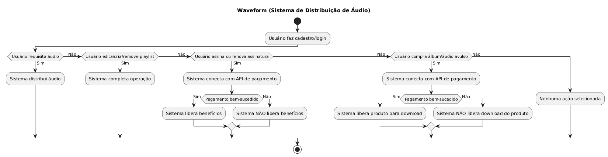

# Waveform
### Sistema de Distribuição de Áudio
Projeto de Tóp. Avançados de Engenharia de Software do 7º Semestre (FEI)
- Augusto Pereira Teixeira - 24.123.008-5
- João Pedro Bazoli Palma - 24.123.041-6
- Luana Bortko Rodrigues -  24.123.006-9
- Juan Manuel Citta - 24.123.022-6
- Sebastian Citta - 24.123.068-9

## Diagrama de Atividades Simplificado


Documento inicial dentro do repositório: [link](./doc/definicao_do_projeto.docx)

## Framework escolhido - VueJS
VueJS foi escolhido por ser simples de entender e utilizar linguagens _web_ tradicionais (HTML, CSS, JavaScript), com a adição de TypeScript opcional podendo facilitar o desenvolvimento a depender das necessidades dos desenvolvedores.

## Implementação

A implementação se encontra na pasta `implementacao/Waveform` nesse repositório. Dentro dela contém um README com instruções para testar e rodar o código.

## Testando o Cálculo de Pagamento

### Pré-requisitos
- Docker rodando (`docker compose up -d` dentro de `implementacao/waveform`)
- Backend rodando (`node index.js` dentro de `implementacao/waveform/backend`)

### 1. Registrar streams manualmente (opcional)
Para simular plays sem precisar usar o frontend, use curl:
```bash
curl -X POST http://localhost:3000/api/songs/1/stream
```
Repita o comando quantas vezes quiser para acumular streams. Troque o `1` pelo ID da música desejada.

### 2. Verificar streams no banco
```bash
docker exec -it postgres-custom psql -U fei -d maindb -c "SELECT * FROM streams;"
```

### 3. Consultar o pagamento de um artista
```bash
curl http://localhost:3000/api/artists/1/pagamento
```
Troque o `1` pelo ID do artista. A resposta será:
```json
{
  "artista": "Nome do Artista",
  "streams_ultimo_mes": 42,
  "valor_por_stream": 0.005,
  "pagamento_total": 0.21
}
```

> O valor de R$ 0,005 por stream é provisório. Altere a constante `VALOR_POR_STREAM` em `backend/index.js` após definir o valor correto com o grupo.
